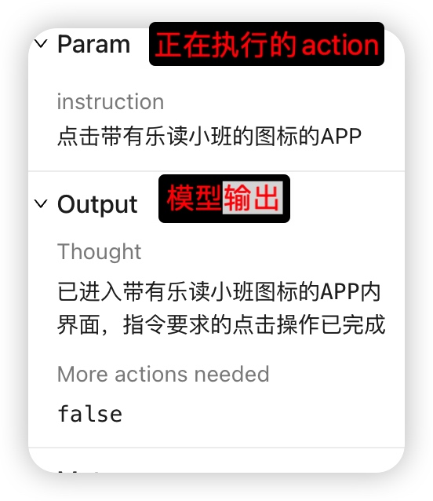
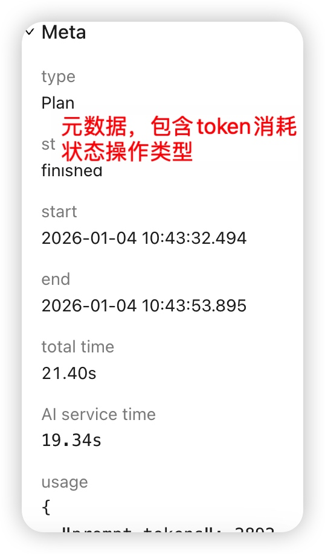
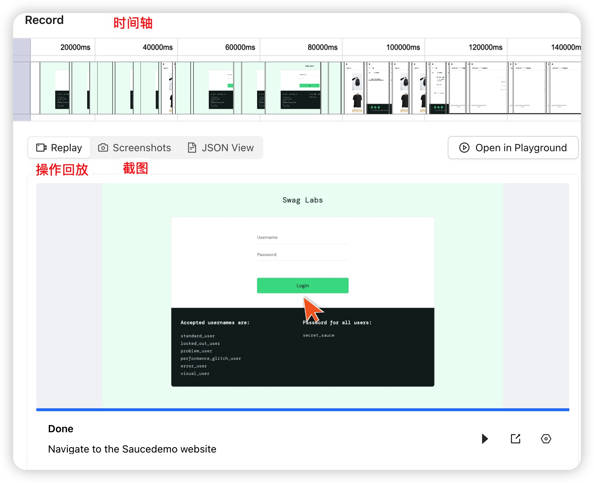
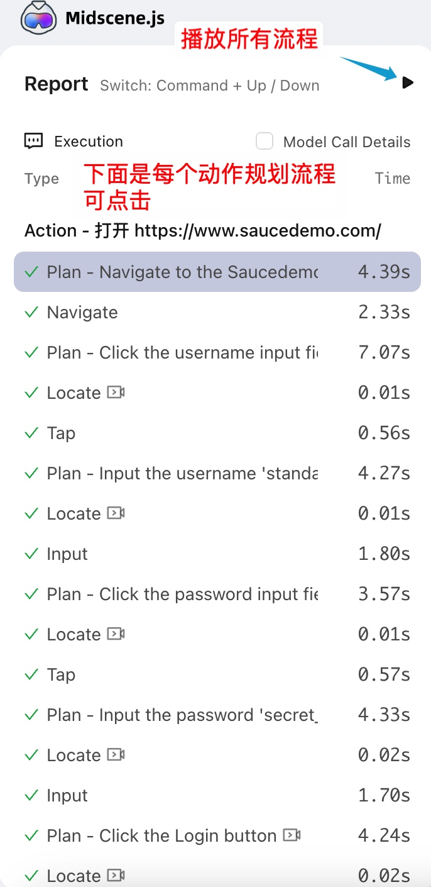

# UI Automation Demo

> 基于 MidScene AI、Playwright、ADB 和 Appium 的智能化 UI 自动化测试平台。

## 📖 项目简介

本项目是一个轻量级、智能化的 UI 自动化测试平台。通过集成 MidScene AI，实现了通过自然语言指令编写和执行测试用例。

支持 **Web**、**Android** 和 **iOS** 三大平台的自动化测试。不仅支持本地执行，还支持通过 **分布式 Agent** 模式在远程设备上执行测试，可实现本地运行脚本，远程服务器无需关心设备环境。

### 核心特性

- **🤖 AI 驱动**：使用自然语言（如 "点击搜索框", "输入 content"）编写测试步骤，降低自动化门槛。
- **🌐 全平台支持**：
  - **Web 端**：基于 Playwright，支持主流浏览器自动化。
  - **📱 Android 端**：基于 ADB 和 MidScene，支持安卓真机/模拟器自动化。
  - **🍎 iOS 端**：基于 XCUITest 和 MidScene，支持 iOS 真机/模拟器自动化。
- **🔌 分布式架构**：
  - **Server-Agent 模式**：服务器可部署在云端/Docker，通过 WebSocket 连接本地 Agent 执行真机测试。
  - **内网穿透**：Agent 主动连接 Server，无需 Server 拥有公网 IP 即可管理内网设备。
- **🚀 批量执行**：支持多用例批量排队执行，内置并发控制。
- **📊 可视化报告**：生成详细的 HTML 测试报告，包含步骤截图、视频回放和 AI 分析。
- **⚡️ 实时监控**：WebSocket 实时推送任务状态和进度，支持一键停止任务。

---

## 🛠 快速开始

### 1. 环境准备

#### 基础环境
- **Node.js**: >= 18.0.0
- **pnpm**
- 视觉模型的API

#### 平台特定依赖
- **Web**: 需要安装 Playwright 浏览器 (`npx playwright install`)
- **Android**: 需要安装 Android SDK (ADB)，并确保 `adb` 在 PATH 中。
- 官方文档：https://midscenejs.com/zh/android-getting-started.html
- **iOS**: 需要 macOS 环境，安装 Xcode 和 Command Line Tools以及WebDriverAgent。官方文档：https://midscenejs.com/zh/ios-getting-started.html
### 2. 安装依赖（需要拉取代码到本地安装）

```bash
# 安装项目依赖
npm install

# 安装 Playwright 浏览器（仅 Web 测试需要）
npx playwright install
```

### 3. 配置环境

复制 `.env.example` 为 `.env` 并配置 AI 模型密钥：
可参考.env.example 中的注释，填写自己的 MidScene 模型配置。
在 `.env` 中填入你的 `MIDSCENE_MODEL_API_KEY` 等信息。
更多配置可参考官方文档：https://midscenejs.com/zh/model-common-config.html。 官方文档详细说明了不同模型的配置方式，这里建议使用ui-tars-1.5

### 4. 启动服务 (开发模式)

推荐使用一键启动脚本，同时启动前后端并自动处理端口冲突：

```bash
# 首次运行需添加执行权限
chmod +x start-all.sh

./start-all.sh
```

或者手动分别启动：

```bash
# 同时启动前后端
npm run dev
```

访问地址：`http://localhost:5173`

---

## 🔌 分布式 Agent 使用指南

当服务器部署在 Docker 或远程服务器时，无法直接连接本地的 Android/iOS 设备。此时需要使用 Agent 模式。

### 1. 启动本地服务

在连接了手机的电脑上运行：

# 启动 iOS Agent 并命名为 "My-iPhone-15"（一定要使用自己的专属命名，建议以自己的名字命名）
AGENT_NAME="My-iPhone-15" npm run agent:ios

# 启动 Android Agent 并命名为 "Pixel-8-Pro"
AGENT_NAME="Pixel-8-Pro" npm run agent:android

### 2. 在平台使用

本地服务启动后会自动注册到服务器。在创建或执行测试用例时，系统会自动发送到你的电脑上执行。

## 📖 使用指南

### 1. 创建测试用例
- 点击左上角 **"新建用例"**。
- 选择平台：**Web**、**Android** 或 **iOS**。
- **编写步骤**：使用自然语言描述操作。
  - 请将需求拆解成一个个具体的步骤，每个步骤以换行结束，例如：
    打开 https://www.saucedemo.com/
    输入 standard_user 到 用户名输入框
    输入 secret_sauce 到 密码输入框
    点击 登录按钮
  - Web 示例：`打开 https://www.saucedemo.com/` -> `输入 standard_user 到 用户名输入框`
  - Android/iOS 示例：`点击 搜索框` -> `输入 物理` -> `点击 搜索`
  **注意事项**：
  - 每个步骤之间请用换行符隔开，不要用逗号或其他分隔符。
  - 每个步骤请用中文描述，不要用英文。
  - 由于每次执行单个步骤时候，会像大模型发送一次网络请求，因此请将自然语言描述，尽可能清晰且步骤不要太多，或将多个步骤合并为一个步骤（由具体情况调整）。
  - 针对于乐读App，由于包名原因，ai会首先查看乐读拼音名的安装包，但是测试app的包命名是英文字母的随意组合，因此无法启动，需要在创建用例时，告诉ai点击带有乐读小班图标的app才可打开。
  - 针对于乐读App的搜索，由于搜索功能没有显示的搜索按钮，因此ai无法执行搜索功能，切由于未知原因，测试在其他app上都可执行输入文字并回车，而乐读app输入文字后，文字消失导致搜索失败，因此请请告诉ai输入文本后，长按搜索框点击粘贴，然后按下回车键，以下是具体示例：
    点击搜索框，直到出现输入光标，如果搜索框里已有文字，长按搜索框，点击全选，然后删除清空，最后输入小班化学。
    长按搜索框直至出现粘贴界面，点击粘贴。
    如果没有出现“粘贴”，再次长按搜索框直到出现“粘贴”，然后点击“粘贴”，如果搜索框已经包含”小班化学“请忽略。
    按下回车键。
  - 如果粘贴文字，请给予app访问剪切版的权限，ai底层是通过操作剪切版来实现输入文字的。
  - 如果想查询某个页面的内容，请在用例中添加查询步骤，例如：查询：(支持中英文双冒号) {price:string,title:string}，帮我当前页面查询价格与课程标题.
  - 如果想要断言某个条件，请输入断言语句，例如：断言：{price:199,title:"小班化学"}，帮我断言当前页面价格是否为199，课程标题是否为"小班化学"。


### 2. 执行测试
- **单条执行**：在用例列表中点击 "执行" 按钮，选择你的设备。
- **批量执行**：勾选多个用例，点击顶部的 "批量执行" 按钮。

### 3. 查看结果
- **实时状态**：列表中的状态图标和进度条会实时更新。
- **测试报告**：执行完成后，点击 "查看报告" 链接打开详细的 HTML 报告。
- **视频回放**：报告中包含每个步骤的视频截图，帮助你快速定位问题。
- **错误截图**：如果步骤失败，报告会包含该步骤的截图，帮助你快速定位问题。
- **页面右侧信息解释**：
- 

- **主页面介绍**
- 


- **断言结果（与）**：如果用例中包含断言语句，报告右侧元数据（meta）会显示断言的结果，帮助你验证测试是否通过。
- **用例执行时间**：报告会显示每个用例的执行时间在左上角，帮助你评估测试效率。
- **用例执行结果**：报告会显示每个用例的执行结果，帮助你快速定位问题。

### 4. 任务管理
- **停止任务**：点击左侧菜单栏顶部的 🔴 **停止按钮**，可一键终止所有正在运行和排队的任务。
- **强制重置**：如果遇到状态异常，点击左侧菜单栏的 **强制重置** 按钮修复。
