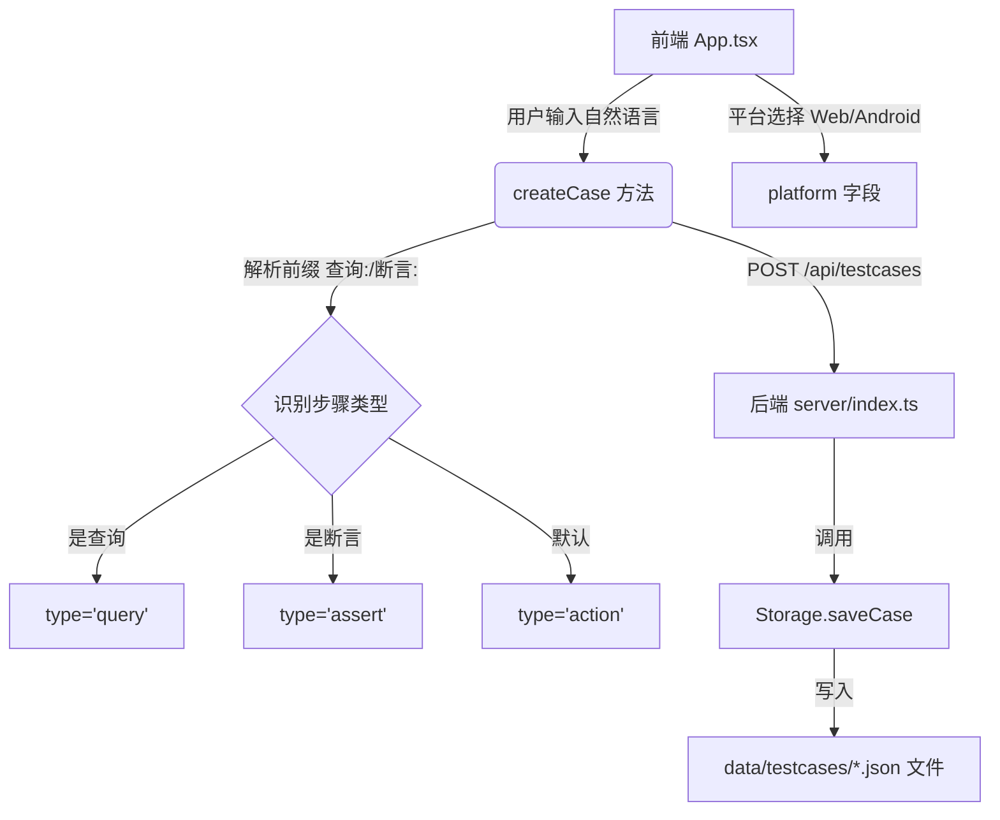

# 核心功能代码实现深度解析

本文档旨在协助开发人员全面理解本项目三个核心模块（创建用例、执行用例、生成报告）的代码实现细节。

## 1. 创建用例模块 (Case Creation)

该模块负责接收用户输入的自然语言测试步骤，将其解析为结构化的测试用例数据，并持久化存储。

### 1.1 数据结构设计
核心数据类型定义在 `server/types.ts` 中，采用 TypeScript 接口定义。

```typescript
// 测试步骤：最小执行单元
export type TestStep = {
  id: string
  type?: 'action' | 'query' | 'assert' // 区分三种模式：操作、查询、断言
  action: string                       // 自然语言描述，例如 "点击登录按钮"
}

// 测试用例：包含元数据和步骤集合
export type TestCase = {
  id: string
  name: string
  description?: string
  platform: 'web' | 'android'
  steps: TestStep[]
  status: 'idle' | 'running' | 'done' | 'error' // 当前状态
  lastRunAt?: number    // 最后执行时间戳
  lastReportPath?: string // 最后一次报告的相对路径
}
```

### 1.2 核心类/方法调用关系


### 1.3 关键实现说明
- **自然语言解析 (src/App.tsx)**:
  前端 `createCase` 函数通过简单的字符串匹配逻辑，将用户输入的每一行文本转换为 `TestStep` 对象。
  - 识别 `查询:` 前缀 -> 映射为 `query` 类型
  - 识别 `断言:` 前缀 -> 映射为 `assert` 类型
  - 其他 -> 默认为 `action` 类型

- **持久化存储 (server/storage.ts)**:
  采用文件系统作为简易数据库。
  - **保存**: 将 `TestCase` 对象序列化为 JSON，文件名格式为 `[Name]_[Date]_[ID].json`，存储在 `data/testcases/` 目录下。
  - **读取**: `loadCases` 方法遍历目录，反序列化 JSON 文件加载到内存缓存中。

---

## 2. 执行用例模块 (Case Execution)

该模块是自动化的核心引擎，负责调度 Playwright 浏览器和 MidScene AI 代理执行测试步骤。

### 2.1 执行引擎工作流程
代码位于 `server/runner.ts` 的 `runTestCase` 函数。


### 2.2 关键策略实现
- **环境初始化与清理**:
  - **初始化**: 每次执行都会 `await chromium.launch()` 创建新的浏览器实例和上下文，确保测试环境的隔离性（无 Cookie 污染）。
  - **清理**: 使用 `try...finally` 模式（代码中体现为 `try...catch` 后跟 `browser.close()`），无论测试成功或失败，都强制关闭浏览器释放资源。

- **异常处理**:
  - 整个执行过程包裹在 `try...catch` 块中。
  - 一旦某个步骤抛出异常（如元素未找到、AI 解析失败），捕获错误并将 `Execution.status` 标记为 `failed`，同时记录 `errorMessage`。

- **MidScene 集成**:
  - 利用 `PlaywrightAgent` 代理常规操作。
  - 通过 `generateReport: true` 配置，让 MidScene 自动收集执行过程中的截图、DOM 树和 AI 思考过程。

### 2.3 平台化执行路由（Web/Android 一致 API）

执行入口统一在 `server/index.ts`：

- `POST /api/execute/:id`：创建一条 execution 并异步执行
- `POST /api/stop-execution/:id`：停止执行

关键点：

- **接口保持一致**：前端不需要因为平台不同切换接口路径或参数结构。
- **路由基于用例 platform**：后端根据 `TestCase.platform` 选择对应 runner（Web -> `server/runner.ts`，Android -> `server/runner.android.ts`）。

### 2.4 Android 执行引擎（独立 runner）

Android 执行逻辑独立放在 `server/runner.android.ts`，与 Web runner 不共用实现文件，保证依赖与适配层隔离：

- **独立依赖导入机制**：通过动态导入 `@midscene/android`，避免 Web runner 的依赖链被 Android 侧影响。
- **核心执行逻辑对齐**：保持与 Web runner 相同的核心结构（进度回调、逐步执行、报告文件名规则、统一 RunResult）。
- **Android 特定适配层**：使用 `AndroidDevice/AndroidAgent`，将 `action/query/assert` 映射为 `aiAct/aiQuery/aiAssert`。
- **资源清理与取消**：执行结束或取消时销毁设备连接，避免悬挂资源。

### 2.5 执行 ID 生成与并发唯一性

Execution ID 由 `server/storage.ts` 生成。为支持并发执行场景，ID 会包含随机后缀，避免同一秒内多次触发导致碰撞。

---

## 3. 生成报告模块 (Report Generation)

该模块负责收集执行数据并生成可视化报告。

### 3.1 报告生成逻辑
报告生成主要依赖 MidScene SDK 的内置能力，辅以自定义的后处理。

- **数据收集**: 
  - 在 `PlaywrightAgent` 初始化时设置 `generateReport: true`。
  - 在执行 `mid.ai`, `mid.aiQuery` 等方法时，MidScene 会自动记录：
    - 当前页面截图
    - DOM 结构快照
    - AI 的 Prompt 和 Response
    - 执行耗时

- **报告格式**:
  - **HTML**: MidScene 默认生成包含交互式时间轴的 HTML 报告。
  - **文件命名**: 在 `server/runner.ts` 中指定 `reportFileName: ${exec.id}-${testCase.id}`，确保报告文件唯一对应一次执行。

### 3.2 报告存储与分发
- **存储**:
  - 报告文件统一保存在项目根目录的 `midscene_run/report/` 文件夹下。
  - 这是一个物理磁盘路径，通过 `server/index.ts` 中的 `exp.static` 中间件暴露给 Web 访问。

- **分发/查看**:
  - 前端通过 `/reports/[文件名].html` 路径访问。
  - 后端在执行完成后，将生成的 `reportPath` 更新到 `Execution` 和 `TestCase` 对象中，通过 WebSocket 通知前端刷新链接。

- **降级处理**:
  - 如果未配置 MidScene 模型（环境变量缺失），代码会生成一个“占位报告” (Fallback HTML)，提示用户进行配置，防止程序崩溃。

```typescript
// server/runner.ts 中的降级逻辑
if (hasModel && mid) {
  // 使用 MidScene 生成的报告路径
} else {
  // 手动写入一个简单的 HTML 文件
  const html = `...<h2>未配置MidScene模型...`
  fs.writeFileSync(fallback, html, 'utf8')
}
```

---

## 总结
本项目采用**前后端分离**架构，通过**文件系统**进行轻量级数据持久化，利用 **MidScene + Playwright** 作为执行核心。

- **扩展性**: 目前架构简单清晰，易于通过增加数据库支持（如 SQLite/MongoDB）来增强数据管理能力。
- **并发**: 当前为单实例串行或 Node.js 默认异步并发。若需大规模并发，可引入任务队列（如 BullMQ）和 Worker 池。
