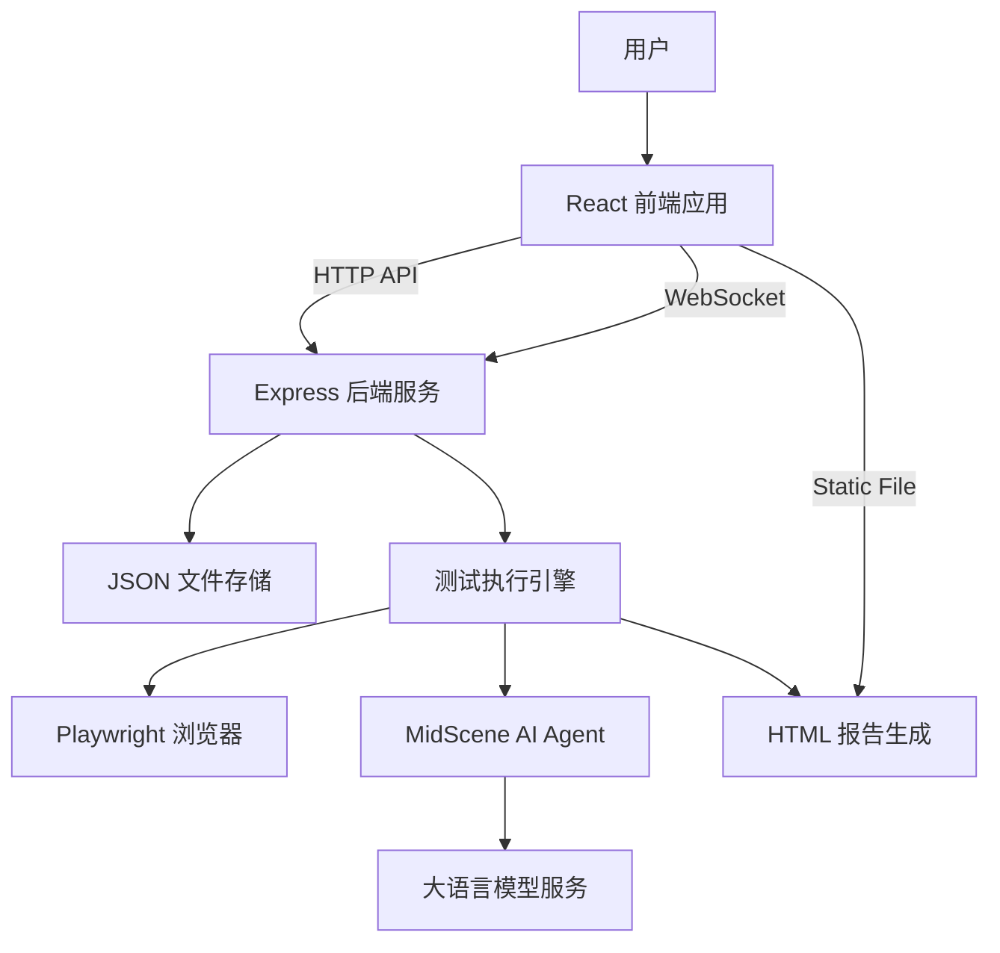
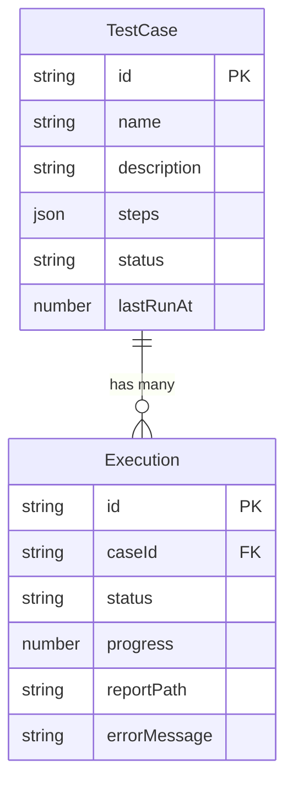

# UI Automation Demo 项目文档

**最后更新日期**: 2025-12-25
**维护人**: 核心开发团队

## 1. 项目概述

### 1.1 基本信息
- **项目名称**: ui-automation-demo
- **版本号**: 0.0.0
- **创建日期**: 2025-12-25
- **项目仓库**: 本地仓库

### 1.2 项目背景与业务目标
本项目旨在提供一个轻量级、智能化的 UI 自动化测试平台。通过集成 MidScene AI 和 Playwright，降低 UI 自动化测试的门槛，允许用户通过自然语言指令编写和执行测试用例，并生成可视化报告。后续将集成安卓与ios应用的自动化测试。

**主要目标**:
- 演示 AI 辅助的 UI 自动化测试能力。
- 提供简单易用的 Web 界面管理测试用例。
- 实现测试执行过程的报告生成。
- 支持安卓与ios应用的自动化测试。
- 最终投入生产

### 1.3 技术栈说明
- **前端**: React 19, Vite 7, TypeScript
- **后端**: Node.js, Express 5, WebSocket (ws)
- **自动化引擎**: Playwright, MidScene AI (SDK)
- **数据存储**: 本地 JSON 文件存储 (Persistence Layer)
- **开发工具**: ESLint, Prettier, nodemon

### 1.4 系统架构


---

## 2. 接口文档（核心部分）

**Base URL**: `http://localhost:3002`

### 2.1 健康检查
- **接口路径**: `/api/health`
- **请求方法**: `GET`
- **请求参数**: 无
- **响应结构**:
  ```json
  { "ok": true }
  ```

### 2.2 获取测试用例列表
- **接口路径**: `/api/testcases`
- **请求方法**: `GET`
- **响应结构**:
  ```json
  {
    "data": [
      {
        "id": "uuid-string",
        "name": "用例名称",
        "status": "idle"
      }
    ]
  }
  ```

### 2.3 创建测试用例
- **接口路径**: `/api/testcases`
- **请求方法**: `POST`
- **请求参数**:
  ```json
  {
    "name": "百度搜索测试", // 必填
    "description": "测试百度搜索功能", // 选填
    "steps": [ // 必填
      { "id": "step-1", "action": "打开 https://www.baidu.com" }
    ]
  }
  ```
- **响应结构**: 返回创建成功的用例对象。

### 2.4 执行测试用例
- **接口路径**: `/api/execute/:id`
- **请求方法**: `POST`
- **路径参数**: `id` (测试用例 ID)
- **响应结构**:
  ```json
  {
    "data": {
      "id": "exe-timestamp",
      "status": "queued",
      "progress": 0
    }
  }
  ```

### 2.5 获取执行记录
- **接口路径**: `/api/executions`
- **请求方法**: `GET`
- **响应结构**: 返回所有历史执行记录列表。

---

## 3. 数据库设计

本项目采用轻量级文件存储，数据保存在 `data/` 目录下。

### 3.1 实体关系图 (ER图)


### 3.2 数据表说明

#### 3.2.1 testcases (存储于 `data/testcases/*.json`)
| 字段名 | 类型 | 约束 | 说明 |
| :--- | :--- | :--- | :--- |
| id | string | PK | UUID |
| name | string | Not Null | 用例名称 |
| description | string | Nullable | 用例描述 |
| steps | array | Not Null | 测试步骤列表 |
| status | enum | 'idle','running','done','error' | 当前状态 |
| lastRunAt | number | Nullable | 最后执行时间戳 |
| lastReportPath | string | Nullable | 最后一次报告路径 |

#### 3.2.2 executions (存储于 `data/executions/*.json`)
| 字段名 | 类型 | 约束 | 说明 |
| :--- | :--- | :--- | :--- |
| id | string | PK | 执行ID (exe-时间戳) |
| caseId | string | FK | 关联的用例ID |
| status | enum | 'queued','running','success','failed' | 执行状态 |
| progress | number | 0-100 | 执行进度百分比 |
| createdAt | number | Not Null | 创建时间 |
| updatedAt | number | Not Null | 更新时间 |
| reportPath | string | Nullable | 报告文件的本地路径 |
| errorMessage | string | Nullable | 错误信息 |

---

## 4. 功能模块说明

### 4.1 测试执行模块
**核心逻辑**:
1. 接收执行请求，创建 `Execution` 记录。
2. 启动 Playwright 浏览器实例。
3. 初始化 MidScene Agent (如果配置了 AI 模型)。
4. 遍历 `TestCase.steps`：
   - 解析步骤类型 (`action`, `query`, `assert`)。
   - 调用 `mid.ai()`, `mid.aiQuery()`, 或 `mid.aiAssert()`。
   - 实时通过 WebSocket 推送进度。
5. 生成 HTML 报告并保存路径。
6. 关闭浏览器，更新执行状态。

### 4.2 实时通信模块
- 使用 WebSocket (`/ws`) 推送状态更新。
- 消息类型: `execution` (执行进度更新), `testcase` (用例状态更新)。

### 4.3 已知问题
- **问题**: 并发执行多个任务时可能导致资源争抢。
- **解决方案**: 目前前端 UI 限制了一次只能触发一个执行。后续可引入任务队列 (Queue)。

---

## 5. 部署指南

### 5.1 环境要求
- **Node.js**: v18.0.0 或更高版本
- **操作系统**: macOS, Linux, Windows (WSL)
- **浏览器**: Playwright 支持的浏览器 (Chromium)

### 5.2 依赖安装
```bash
# 1. 克隆代码
git clone <repo-url>
cd ui-automation-demo

# 2. 安装依赖
npm install

# 3. 配置环境变量
cp .env.example .env
# 编辑 .env 文件，填入 MIDSCENE_MODEL_XXX 相关配置
```

### 5.3 启动与停止
- **一键启动**:
  ```bash
  ./start.sh
  ```
- **手动启动**:
  ```bash
  npm run dev
  ```
- **停止服务**:
  - 在终端按 `Ctrl+C`。
  - 如遇端口占用，可使用 `lsof -i :3002` 查找并 kill 进程。

---

## 6. 测试用例集

### 6.1 编写规范
请参考 [TEST_CASE_GUIDE.md](./TEST_CASE_GUIDE.md) 获取详细的自然语言指令编写指南。

### 6.2 常见场景示例
**场景：百度搜索**
```text
打开 https://www.baidu.com
在搜索框输入 "MidScene AI"
点击 "百度一下"
断言: 搜索结果页包含 "MidScene"
```

---

## 7. 运维手册

### 7.1 日志与监控
- **应用日志**: 输出到标准控制台 (stdout/stderr)。建议使用 PM2 等工具托管以持久化日志。
- **报告文件**: 存放在 `midscene_run/report/` 目录下，定期需清理过期的 HTML 文件。
- **数据文件**: 存放在 `data/` 目录下，建议定期备份。

### 7.2 故障处理
- **服务无法启动**: 检查端口 3002/5173 是否被占用。
- **报告无法查看**: 检查 `midscene_run` 目录权限，确认静态资源服务路径配置。
- **AI 指令失败**: 检查 `.env` 中的 API Key 和 Base URL 是否正确，网络是否通畅。

---

## 8. 版本变更记录

### v0.0.1 (Current)
- **功能**:
  - 实现前后端分离架构。
  - 集成 MidScene SDK 支持自然语言控制。
  - 支持 Action/Query/Assert 三种测试模式。
  - 实现测试用例和执行记录的本地文件持久化。
  - 修复报告查看路径映射问题。
- **数据库变更**:
  - 新增 `data/executions` 目录用于存储执行历史。
