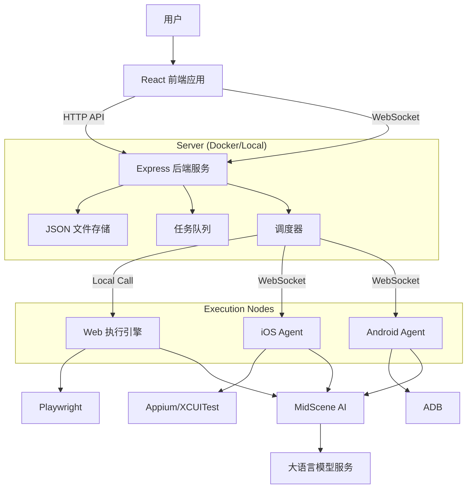

# UI Automation Demo 项目文档

**项目名称**: ui-automation-demo  
**版本号**: 0.2.0  
**创建日期**: 2025-12-25  
**最后更新日期**: 2026-01-04  
**维护人**: 核心开发团队  

---

## 目录

- [1. 项目概述](#1-项目概述)
- [2. 技术架构](#2-技术架构)
- [3. 项目结构](#3-项目结构)
- [4. 部署指南](#4-部署指南)
- [5. 开发规范](#5-开发规范)
- [6. 接口文档](#6-接口文档)
- [7. 附录](#7-附录)

---

## 1. 项目概述

### 1.1 项目背景和业务目标

本项目是一个轻量级、智能化的 UI 自动化测试平台 Demo。通过集成 MidScene AI 与 Playwright/Appium/ADB，降低 UI 自动化测试门槛，允许用户通过自然语言指令编写/执行测试用例并生成可视化报告。

主要目标：

- **AI 驱动**：使用自然语言（Action/Query/Assert/Input）编写测试步骤。
- **全平台支持**：Web (Playwright), Android (ADB), iOS (XCUITest)。
- **分布式架构**：支持 Server-Agent 架构，解决 Docker/云环境无法直接连接本地真机的问题。
- **实时监控**：WebSocket 实时推送任务状态与日志。
- **批量执行**：内置队列管理与并发控制。

### 1.2 项目范围和边界定义

范围（本项目包含）：

- **前端应用**：React + Ant Design，支持用例管理、执行触发、报告查看。
- **后端服务**：Express 服务，负责任务调度、数据存储、静态资源托管。
- **分布式 Agent**：轻量级执行节点，支持 iOS/Android 本地真机执行并回传结果。
- **数据存储**：JSON 文件存储（支持 Docker 卷挂载）。

边界：

- **不包含** 多租户权限管理。
- **不包含** 复杂的设备管理（如 Device Farm 借用流程）。

### 1.3 主要功能模块说明

- **用例管理**：支持 Web/Android/iOS 平台的增删改查。
- **执行调度**：
  - **本地模式**：Server 直接调用本地 Playwright/ADB 执行。
  - **远程模式**：Server 将任务分发给连接的 Agent 执行。
- **Agent 管理**：WebSocket 反向连接，自动注册/心跳保活。
- **报告服务**：统一托管本地和 Agent 上传的 HTML 报告。

---

## 2. 技术架构

### 2.1 系统架构图



### 2.2 技术栈说明

- **前端**: React 19 + Vite 7 + TypeScript + Ant Design
- **后端**: Node.js (ESM) + Express 5 + ws
- **自动化引擎**: 
  - Web: Playwright
  - Android: ADB + MidScene Android Driver
  - iOS: Appium/XCUITest + MidScene iOS Driver
- **分布式通信**: WebSocket (JSON Protocol)
- **部署**: Docker + Docker Compose

### 2.3 开发环境和工具链配置

- **Node.js**: >= 18
- **包管理**: npm/pnpm
- **构建工具**: Vite (Frontend), tsc (Backend)

---

## 3. 项目结构

```
ui-automation-demo/
├── agent/              # 分布式 Agent 源码
│   └── index.ts        # Agent 入口
├── server/             # 后端服务源码
│   ├── index.ts        # 入口与 HTTP/WS 服务
│   ├── protocol.ts     # Agent-Server 通信协议
│   ├── runner.ts       # Web 执行逻辑
│   ├── runner.ios.ts   # iOS 执行逻辑
│   ├── runner.android.ts # Android 执行逻辑
│   └── ...
├── src/                # 前端 React 源码
├── dist/               # 构建产物
│   ├── client/         # 前端静态资源
│   └── server/         # 后端编译代码
├── data/               # 数据存储 (JSON)
├── midscene_run/       # 运行时报告目录
├── Dockerfile          # 容器化配置
└── package.json
```

---

## 4. 部署指南

### 4.1 本地开发
见 README.md "快速开始"。

### 4.2 生产部署 (Docker)

**Server 端**:
1. 构建镜像: `docker build -t ui-automation-demo .`
2. 运行容器: `docker run -p 3002:3002 --env-file .env ui-automation-demo`

**Agent 端 (连接真机)**:
1. 在连接手机的电脑上拉取代码。
2. 安装依赖: `npm install`
3. 运行 Agent:
   ```bash
   export SERVER_URL="ws://<docker-host-ip>:3002/ws"
   npm run agent:ios     # 或 agent:android
   ```

---

## 5. 开发规范

- **语言**: 全栈 TypeScript。
- **模块化**: ESM (ECMAScript Modules)。
- **代码风格**: 使用 ESLint + Prettier。
- **Git 提交**: 遵循 Conventional Commits。

---

## 6. 接口文档

### HTTP API
- `GET /api/testcases`: 获取用例列表
- `POST /api/testcases`: 创建用例
- `POST /api/executions`: 触发执行
- `POST /api/executions/batch`: 批量执行

### WebSocket 协议
- **Server -> Client**: 推送 `execution` 和 `testcase` 状态更新。
- **Agent -> Server**: 注册 (`REGISTER`)、任务更新 (`TASK_UPDATE`)、心跳 (`HEARTBEAT`)。
- **Server -> Agent**: 下发任务 (`RUN_TASK`)、取消任务 (`CANCEL_TASK`)。

---

## 7. 功能特性指南

### 7.1 Android 中文输入增强

默认情况下，Midscene Android 使用 YADB 工具通过剪切板注入中文字符。如果您的测试环境或设备禁用了剪切板，可以通过以下方式使用 **ADBKeyBoard** 进行输入。

#### 前置条件
需要安装 `ADBKeyBoard.apk`。项目提供了辅助脚本进行检测和安装：
```bash
npx tsx scripts/install-adb-keyboard.ts
```

#### 使用方法
在测试用例的输入步骤中，使用 `[ADB]` 前缀：
- **自然语言指令**: `输入：[ADB]你好世界`
- **代码实现**: 底层会自动切换到 ADBKeyBoard 输入法并使用 Base64 广播发送文本，绕过剪切板限制。

---

## 8. 附录

- [MidScene 文档](https://midscenejs.com)
- [Playwright 文档](https://playwright.dev)
