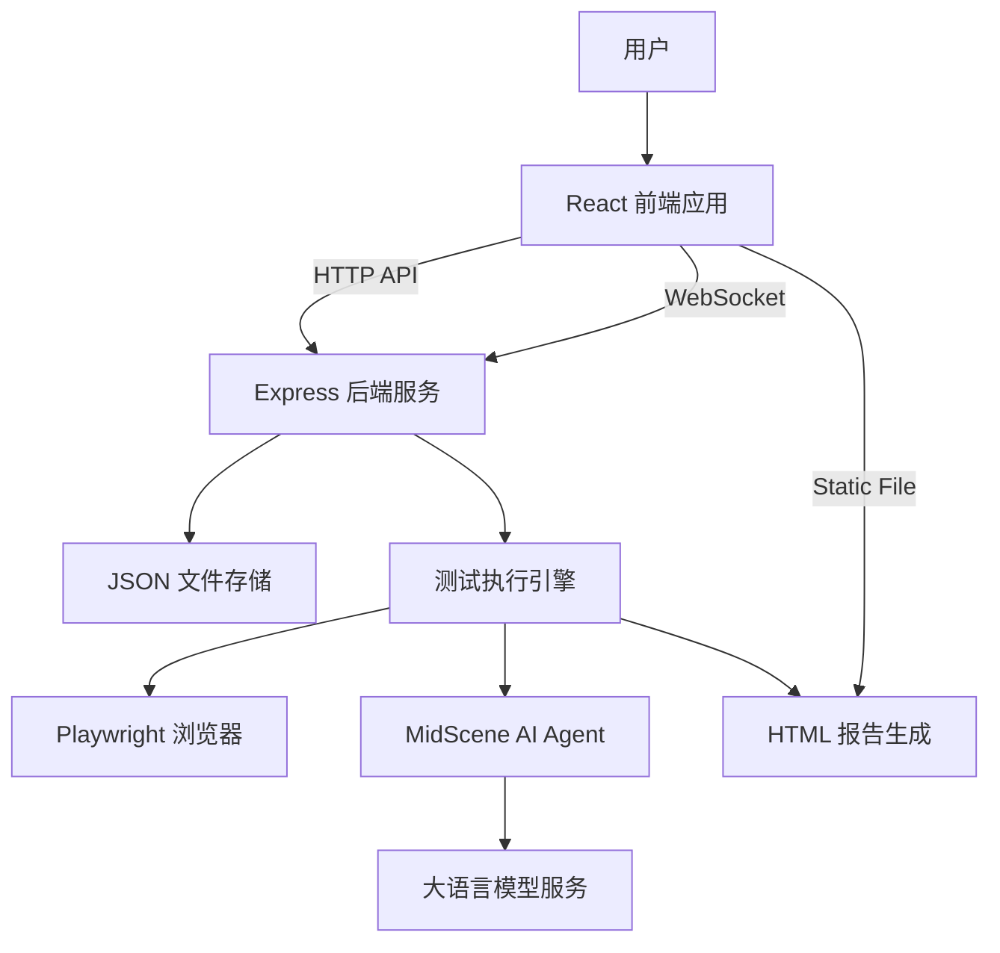
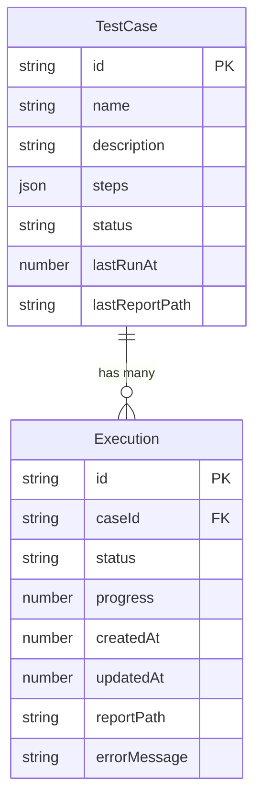

# UI Automation Demo 项目文档

**项目名称**: ui-automation-demo  
**版本号**: 0.0.0  
**创建日期**: 2025-12-25  
**最后更新日期**: 2025-12-26  
**维护人**: 核心开发团队  

---

## 目录

- [1. 项目概述](#1-项目概述)
- [2. 技术架构](#2-技术架构)
- [3. 项目结构](#3-项目结构)
- [4. 部署指南](#4-部署指南)
- [5. 开发规范](#5-开发规范)
- [6. 接口文档](#6-接口文档)
- [7. 附录](#7-附录)

---

## 1. 项目概述

### 1.1 项目背景和业务目标

本项目是一个轻量级、智能化的 UI 自动化测试平台 Demo。通过集成 MidScene AI 与 Playwright，降低 UI 自动化测试门槛，允许用户通过自然语言指令编写/执行测试用例并生成可视化报告，并提供前后端联调与回归测试样例，便于快速扩展到生产级能力。

主要目标：

- 演示 AI 辅助 UI 自动化测试能力（自然语言 Action/Query/Assert）
- 提供 Web 界面管理测试用例、触发执行、查看报告
- 提供执行过程状态回传（WebSocket）与报告分发

### 1.2 项目范围和边界定义

范围（本项目包含）：

- 单节点前后端分离应用：React 前端 + Express 后端
- 文件存储：测试用例与执行记录落盘为 JSON
- 报告生成：MidScene 生成 HTML 报告（未配置模型时生成占位报告）

边界（本项目不包含或仅 Demo 级实现）：

- 多租户/权限体系、审计合规、账号体系
- 生产级任务队列与 Worker 池（当前为 Node 进程内异步任务）
- 生产级限流、鉴权、灰度发布、可观测性平台接入（可扩展）
- 数据库存储与迁移（当前为 JSON 文件）

### 1.3 主要功能模块说明

- **用例管理**：创建/更新/查看测试用例（前端输入自然语言 -> steps）
- **执行调度**：触发用例执行，维护 Execution 状态与进度
- **报告服务**：将报告目录以静态资源方式暴露为 `/reports/*`
- **实时推送**：执行/用例状态通过 `/ws` 推送给前端
- **联调回归**：Node 内置测试覆盖核心流程、并发一致性与简单性能

---

## 2. 技术架构

### 2.1 系统架构图



### 2.2 技术栈说明

- **前端**: React 19 + Vite 7 + TypeScript
- **后端**: Node.js (ESM) + Express 5 + ws
- **自动化引擎**: Playwright + MidScene SDK
- **数据存储**: 本地 JSON 文件（用例、执行记录）
- **测试**: Node.js `node:test`
- **质量**: ESLint（项目内置规则）

### 2.3 开发环境和工具链配置

端口约定：

- **后端**：默认 `3002`（可通过 `PORT` 覆盖）
- **前端**：Vite 默认 `5173`
- **WebSocket**：`/ws`（由 Vite dev server 代理到后端）

开发/构建脚本（来自 `package.json`）：

- `npm run dev`：启动 Vite 开发服务器
- `npm run dev:server`：后端 `tsc --watch` + `nodemon` 启动编译产物
- `npm run build:server`：编译后端到 `dist/server`
- `npm test`：构建后端 + 运行 `server/test/*.test.js`
- `npm run lint`：ESLint
- `npm run build`：TypeScript build + Vite build

### 2.4 第三方依赖库及其版本

运行时依赖：

- `@midscene/web` `^1.0.3`
- `dotenv` `^17.2.3`
- `express` `^5.2.1`
- `playwright` `^1.57.0`
- `react` `^19.2.0`
- `react-dom` `^19.2.0`
- `ws` `^8.18.3`
- `zod` `^4.2.1`

开发依赖（节选）：

- `typescript` `~5.9.3`
- `vite` `^7.2.4`
- `eslint` `^9.39.1`
- `concurrently` `^9.2.1`
- `nodemon` `^3.1.11`

### 2.5 数据存储方案和数据库设计

存储位置（默认）：

- 用例：`data/testcases/*.json`
- 执行：`data/executions/*.json`
- 报告：`midscene_run/report/*.html`

存储位置（可配置，便于联调/CI 隔离）：

- `UI_AUTOMATION_DATA_DIR`：用例目录（默认 `data/testcases`）
- `UI_AUTOMATION_EXEC_DIR`：执行目录（默认 `data/executions`）
- `UI_AUTOMATION_REPORT_DIR`：报告目录（默认 `midscene_run/report`）

实体关系（ER）：



---

## 3. 项目结构

### 3.1 代码目录结构说明

```text
ui-automation-demo/
  docs/                   # 项目文档
  server/                 # 后端（Express + 执行引擎）
    test/                 # node:test 联调与回归
  src/                    # 前端（React）
  public/                 # 静态资源
  data/                   # 默认数据目录（JSON 文件）
  midscene_run/report/    # 默认报告目录（运行时生成）
```

### 3.2 主要代码文件及其功能

后端：

- `server/index.ts`：HTTP API + WebSocket + 静态报告服务 + 错误兜底
- `server/storage.ts`：用例/执行记录的内存缓存与文件持久化
- `server/runner.ts`：Playwright + MidScene 执行与报告生成
- `server/types.ts`：后端数据类型定义

前端：

- `src/App.tsx`：用例编辑/执行/报告查看与错误提示、WS 订阅
- `vite.config.ts`：开发期代理（`/api`、`/ws`、`/reports`）

### 3.3 配置文件说明

- `package.json`：脚本、依赖与版本（项目为 ESM：`"type": "module"`）
- `tsconfig.server.json`：后端编译配置（输出到 `dist/server`）
- `.nodemon.json`：监听后端编译产物变更并重启
- `eslint.config.js`：ESLint 规则（React + TS）
- `start.sh`：一键启动（构建后端 + 并发启动后端/前端）

### 3.4 测试目录结构

- `server/test/api-contract.test.js`：创建→执行→报告、并发一致性、批量创建性能
- `server/test/server-start.test.js`：验证后端编译产物可启动

---

## 4. 部署指南

### 4.1 环境要求

- Node.js：建议 `>= 18`
- Playwright：首次运行需要下载浏览器（由 Playwright 自动管理）
- 操作系统：macOS / Linux / Windows（WSL）

### 4.2 安装和配置步骤

```bash
npm install
```

环境变量（建议在项目根目录创建/维护 `.env`，不要提交真实密钥）：

- `PORT`：后端端口（默认 3002）
- `MIDSCENE_MODEL_BASE_URL`：模型服务地址
- `MIDSCENE_MODEL_API_KEY`：模型密钥
- `MIDSCENE_MODEL_NAME`：模型名称
- `UI_AUTOMATION_DATA_DIR` / `UI_AUTOMATION_EXEC_DIR` / `UI_AUTOMATION_REPORT_DIR`：可选，目录覆盖

### 4.3 启动和停止流程

一键启动（开发联调推荐）：

```bash
./start.sh
```

手动启动：

```bash
# 1) 启动后端（推荐使用 dev:server）
npm run dev:server

# 2) 另开终端启动前端
npm run dev
```

停止服务：

- 终端 `Ctrl+C`
- 端口冲突时排查占用进程后停止

### 4.4 运维监控方案（建议）

项目内置能力：

- HTTP 请求日志：每个请求生成 `x-request-id`，记录 method/url/status/耗时
- 进程级异常兜底：`unhandledRejection` / `uncaughtException` 输出

生产建议：

- 使用进程管理器（如 PM2/systemd）托管与保留日志
- 反向代理层接入限流与鉴权（如 Nginx/API Gateway）
- 报告与数据目录定期备份与过期清理

---

## 5. 开发规范

### 5.1 代码风格指南

- TypeScript 优先，保持类型明确与结构化数据
- 前端请求统一走 `api()` 封装，必须处理：非 2xx、非 JSON、超时
- 后端接口返回结构统一：成功 `{ data: ... }`，失败 `{ error: string }`
- 使用 ESLint 作为基础规范：`npm run lint`

### 5.2 分支管理策略（建议）

- `main`：可部署/可演示分支
- `feat/*`：新功能
- `fix/*`：缺陷修复
- `chore/*`：工程化/依赖升级

### 5.3 提交信息规范（建议）

推荐使用 Conventional Commits：

- `feat: ...` / `fix: ...` / `chore: ...` / `test: ...` / `docs: ...`

### 5.4 测试覆盖率要求（建议）

- 核心业务链路：创建用例 → 执行用例 → 查看报告 必须有回归用例
- 并发一致性：并发创建/并发执行至少覆盖 1 组
- 性能基线：批量创建用例的耗时应在可接受阈值内（当前测试设置为 300 条 < 20s）

---

## 6. 接口文档

### 6.1 Base URL

- 开发环境：`http://localhost:3002`

### 6.2 API 端点列表

| 模块 | 方法 | 路径 | 说明 |
| --- | --- | --- | --- |
| Health | GET | `/api/health` | 健康检查 |
| TestCase | GET | `/api/testcases` | 获取用例列表 |
| TestCase | POST | `/api/testcases` | 创建用例 |
| TestCase | PUT | `/api/testcases/:id` | 更新用例 |
| Execution | GET | `/api/executions` | 获取执行记录 |
| Execution | POST | `/api/execute/:id` | 执行用例 |
| Report | GET | `/reports/:file` | 获取 HTML 报告 |
| WS | GET | `/ws` | WebSocket 状态推送 |

### 6.3 请求/响应示例

健康检查：

```http
GET /api/health
```

```json
{ "ok": true }
```

创建用例：

```http
POST /api/testcases
Content-Type: application/json
```

```json
{
  "name": "百度搜索测试",
  "description": "测试百度搜索功能",
  "steps": [{ "id": "s1", "type": "action", "action": "打开 https://www.baidu.com" }]
}
```

```json
{
  "data": {
    "id": "uuid",
    "name": "百度搜索测试",
    "description": "测试百度搜索功能",
    "steps": [{ "id": "s1", "type": "action", "action": "打开 https://www.baidu.com" }],
    "status": "idle",
    "lastRunAt": 1766720000000,
    "lastReportPath": "exe-1766720000000-abcdef12-uuid.html"
  }
}
```

执行用例：

```http
POST /api/execute/:id
```

```json
{
  "data": {
    "id": "exe-时间戳-随机串",
    "caseId": "uuid",
    "status": "queued",
    "progress": 0,
    "createdAt": 1766720000000,
    "updatedAt": 1766720000000
  }
}
```

查看报告：

```http
GET /reports/exe-xxx-yyy-<caseId>.html
```

WebSocket 消息格式：

```json
{ "type": "execution", "payload": { "id": "...", "status": "running", "progress": 50 } }
```

```json
{ "type": "testcase", "payload": { "id": "...", "status": "done", "lastReportPath": "..." } }
```

### 6.4 错误代码说明

| HTTP 状态码 | 场景 | 返回示例 |
| --- | --- | --- |
| 200 | 成功 | `{ "data": ... }` |
| 400 | Body 非法 JSON | `{ "error": "Invalid JSON body" }` |
| 404 | 用例不存在 | `{ "error": "Test case not found" }` |
| 500 | 未处理异常 | `{ "error": "Internal Server Error" }` |

### 6.5 接口调用限制

- 当前实现：无内置限流/鉴权（Demo）
- 建议：生产环境通过反向代理或网关实现限流、鉴权与访问控制

---

## 7. 附录

### 7.1 术语表

| 术语 | 说明 |
| --- | --- |
| TestCase | 测试用例，包含步骤 steps 与状态 |
| Execution | 一次执行记录，包含进度与报告路径 |
| Action/Query/Assert | 三类自然语言步骤：操作/查询/断言 |
| Report | HTML 执行报告，可通过 `/reports/*` 访问 |

### 7.2 常见问题解答

Q：点击执行后长时间没有报告？  
A：未配置 MidScene 模型时会生成占位报告；若配置了模型，确认模型服务可访问且浏览器能启动。

Q：前端访问接口跨域失败？  
A：开发期请通过 Vite 代理访问（`vite.config.ts` 已代理 `/api`、`/ws`、`/reports`）。

Q：报告链接 404？  
A：确认后端 `/reports` 静态目录与生成目录一致；并确保 `reportPath` 为文件名而非绝对路径。

### 7.3 相关参考资料

- Playwright：https://playwright.dev/
- Vite：https://vite.dev/
- Express：https://expressjs.com/
- Node.js `node:test`：https://nodejs.org/api/test.html

### 7.4 变更历史记录

| 日期 | 版本 | 变更 |
| --- | --- | --- |
| 2025-12-25 | 0.0.0 | 初始化 Demo：用例管理、执行、报告、WS 推送 |
| 2025-12-26 | 0.0.0 | 增加并发/性能联调测试、增强日志与异常兜底、报告路径一致性 |
