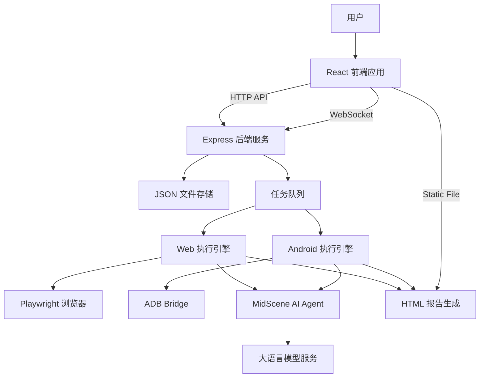

# UI Automation Demo 项目文档

**项目名称**: ui-automation-demo  
**版本号**: 0.1.0  
**创建日期**: 2025-12-25  
**最后更新日期**: 2025-12-30  
**维护人**: 核心开发团队  

---

## 目录

- [1. 项目概述](#1-项目概述)
- [2. 技术架构](#2-技术架构)
- [3. 项目结构](#3-项目结构)
- [4. 部署指南](#4-部署指南)
- [5. 开发规范](#5-开发规范)
- [6. 接口文档](#6-接口文档)
- [7. 附录](#7-附录)

---

## 1. 项目概述

### 1.1 项目背景和业务目标

本项目是一个轻量级、智能化的 UI 自动化测试平台 Demo。通过集成 MidScene AI 与 Playwright/ADB，降低 UI 自动化测试门槛，允许用户通过自然语言指令编写/执行测试用例并生成可视化报告，并提供前后端联调与回归测试样例，便于快速扩展到生产级能力。

主要目标：

- 演示 AI 辅助 UI 自动化测试能力（自然语言 Action/Query/Assert）
- 提供 Web 界面管理测试用例、触发执行、查看报告
- 支持 Web 浏览器和 Android 设备的多端自动化
- 提供执行过程状态回传（WebSocket）与报告分发
- 支持批量任务排队与并发控制

### 1.2 项目范围和边界定义

范围（本项目包含）：

- 单节点前后端分离应用：React 前端 + Express 后端
- **多端支持**：Web (Playwright) + Android (ADB)
- 文件存储：测试用例与执行记录落盘为 JSON
- 报告生成：MidScene 生成 HTML 报告
- **任务调度**：内存队列，支持并发限制和一键停止

边界（本项目不包含或仅 Demo 级实现）：

- 多租户/权限体系、审计合规、账号体系
- 生产级持久化数据库（当前为 JSON 文件）
- 分布式执行节点（当前为单机进程）

### 1.3 主要功能模块说明

- **用例管理**：创建/更新/查看测试用例（Web/Android 平台选择，自然语言步骤）。
- **执行调度**：
  - 支持单用例执行与批量执行。
  - 内置任务队列，默认最大 5 并发。
  - 支持一键终止所有任务。
- **报告服务**：将报告目录以静态资源方式暴露为 `/reports/*`。
- **实时推送**：执行/用例状态通过 `/ws` 推送给前端。
- **状态自愈**：服务重启时自动检测并重置异常状态的任务。

---

## 2. 技术架构

### 2.1 系统架构图

### 2.2 技术栈说明

- **前端**: React 19 + Vite 7 + TypeScript + Ant Design
- **后端**: Node.js (ESM) + Express 5 + ws
- **自动化引擎**: 
  - Web: Playwright
  - Android: ADB + MidScene Android Driver
- **数据存储**: 本地 JSON 文件（`data/testcases`, `data/executions`）
- **测试**: Node.js `node:test`
- **质量**: ESLint（项目内置规则）

### 2.3 开发环境和工具链配置

端口约定：

- **后端**：默认 `3002`（可通过 `PORT` 覆盖）
- **前端**：Vite 默认 `5173`
- **WebSocket**：`/ws`（由 Vite dev server 代理到后端）

开发/构建脚本（来自 `package.json`）：

- `./start.sh`：一键启动完整环境
- `npm run dev`：启动 Vite 开发服务器
- `npm run dev:server`：后端 `tsc --watch` + `nodemon` 启动编译产物
- `npm run build:server`：编译后端到 `dist/server`

---

## 3. 接口文档 (简述)

### 3.1 核心 API

- `GET /api/testcases`: 获取用例列表
- `POST /api/testcases`: 创建用例
- `POST /api/executions`: 触发执行 (支持 `batch: true`)
- `POST /api/admin/stop-all`: 停止所有任务
- `POST /api/admin/reset-status`: 强制重置任务状态

### 3.2 WebSocket 事件

- `execution-update`: 执行状态更新 (进度、日志、结果)
- `case-update`: 用例状态更新
